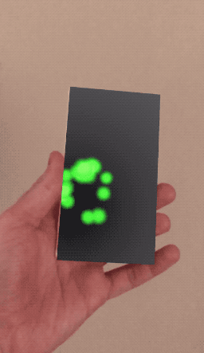

# SceneKit-PortalMask

This class `PortalMask` creates an occluding box around any rectangular frame, including a tracking image, which turns the tracking image or any static area into an Augmented Reality portal into a scene you can define inside that area that can be seen by looking through the defined portal.
This can also be used to have the illusion of a hole in the ground.

Include this pod in your project:
`pod 'PortalMask', :git => 'https://github.com/maxxfrazer/SceneKit-PortalMask.git'`

The following example code creates a portal ontop of a tracking marker, similar to the example gif.

```
func renderer(_ renderer: SCNSceneRenderer, didAdd node: SCNNode, for anchor: ARAnchor) {
	if let imageAnchor = anchor as? ARImageAnchor {
		// the next 2 lines add the portal
		let portal = PortalMask(frameSize: imageAnchor.referenceImage.physicalSize)
		node.addChildNode(portal)

		// the next 4 lines add a cube inside the image area
		let width = imageAnchor.referenceImage.physicalSize.width
		let boxNode = SCNNode(geometry: SCNBox(width: width, height: width, length: width, chamferRadius: 0))
		boxNode.position.z = -boxNode.width
		node.addChildNode(boxNode)
	}
}

```

